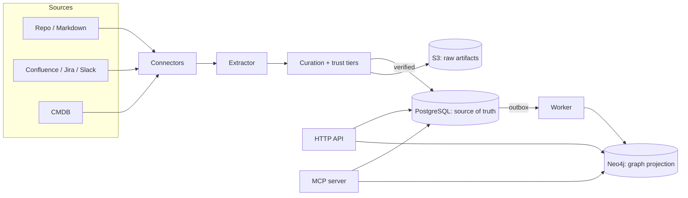

# Architecture and algorithms

How VERA is built, and the methods it uses to grade data, rank results, embed text, and keep
truth over time. For a task-oriented walkthrough, start with the [guides](index.md).

## Architecture

Clean (hexagonal) architecture. Imports point inward only, enforced in CI by import-linter:

```
entrypoints  ->  adapters  ->  application  ->  domain
```

`domain` and `application` import no infrastructure. Ports are `typing.Protocol`; adapters
are the only place infrastructure libraries are imported. Three deployables share one
dependency graph (a modular monolith): the API, the MCP server, and the ingestion worker.



### Source of truth

PostgreSQL and S3 are authoritative. Neo4j is a projection that can be rebuilt from them at
any time. Writes commit to Postgres first; graph updates flow through an outbox, so the graph
is always reconstructable and never the system of record.

### Graph backend (swappable)

The graph is reached through the `MemoryEngine` port and Graphiti, which supports several
backends. VERA exposes `VERA_MEMORY__GRAPH_BACKEND` = `neo4j` (default) or `falkordb`; no
backend is privileged, and because the graph is a rebuildable projection, switching is a
config change plus a `reprocess`. This matters for cost and scale: Neo4j clustering/HA needs
the paid Enterprise edition, whereas FalkorDB (a Redis-module graph) avoids that. FalkorDB
support is **experimental** as of this writing: ingestion and the custom graph operations
(multi-hop traversal, retraction, bi-temporal `as_of`) work, but Graphiti's hybrid *search*
returns no results on FalkorDB in the current version combination, so it is not yet a drop-in
replacement for the retrieval path. Neo4j Community remains the recommended backend; its
usual "need Enterprise for backups" argument is weakened here because a lost graph is rebuilt
from Postgres and S3 rather than restored.

### Tenancy

Every scope has an opaque `group_id`: `o:` organization, `w:` workspace, `p:` project, `u:`
personal. A client never chooses one; VERA assigns them. The knowledge tables enforce
row-level security by `group_id`, so a tenant cannot read another tenant's memory even
through a bug in application code.

## Ingestion and curation

Data never lands in the graph directly. It flows through curation, which decides whether it
is trustworthy enough to publish.

1. **Connect.** A connector pulls records from a source incrementally by a cursor. Secrets
   come from an environment variable named by `token_env`, never the config. Re-ingesting an
   unchanged record is a no-op (content-hash idempotency).
2. **Store the raw artifact** in S3, so the graph stays rebuildable.
3. **Extract claims** into `(subject, predicate, object)`. Structured metadata needs no
   model; free text is extracted by an LLM that normalizes entity names to a canonical form
   and predicates to `UPPER_SNAKE`.
4. **Classify by trust tier** (below) and publish, review, or propose.
5. **Publish** to Postgres and enqueue an outbox job; the worker projects it to the graph and
   stitches each node and edge back to a canonical entity and the published episode.

## Scoring: how data is graded

Every fact is graded on independent axes, set at publish time and carried through retrieval.

**Trust tier of the source (1-4)** drives both the publish decision and the authority score:

| Tier | Meaning        | Publish action  | Authority |
|------|----------------|-----------------|-----------|
| 1    | Authoritative  | auto-publish    | 1.00      |
| 2    | Curated        | auto-publish    | 0.85      |
| 3    | Informational  | review required | 0.70      |
| 4    | Unverified     | proposal only   | 0.40      |

**Verification status** (`human_verified` 1.0 / `auto` 0.8 / `pending` 0.5) records how a
fact was confirmed. **Confidence** (0-1) is the extractor's confidence in the claim. A
**contamination guard** means a shared scope accepts only verified knowledge, so one agent's
guess cannot become another agent's fact.

## Retrieval and ranking

Retrieval is a three-stage pipeline.

### Stage 1: candidate generation

Graphiti's edge hybrid search with reciprocal rank fusion (RRF). RRF merges the semantic
(vector) and lexical (full-text) rankings without needing comparable scores: an item at rank
`r` contributes `1 / (k + r)` from each list, with `k = 1`. A valid-time filter is applied
here (see the temporal model). Search runs once per `group_id` and merges by edge, which is
order-independent.

### Stage 2: weighted blend

VERA re-ranks the candidates by blending signals RRF does not know about. Each candidate's
score is a weighted sum of six signals normalized to [0, 1]:

```
score = w_relevance   * relevance      # stage-1 score, min-max normalized over the batch
      + w_authority    * authority      # source trust tier -> [0.4 .. 1.0]
      + w_verification * verification   # human_verified 1.0 / auto 0.8 / pending 0.5
      + w_recency      * recency        # exp(-ln2 * age / half_life); invalidated -> 0
      + w_feedback     * feedback       # Laplace-smoothed votes: (up + 1) / (up + down + 2)
      + w_confidence   * confidence     # the claim's extraction confidence
```

Defaults: relevance 0.40, authority 0.18, verification 0.12, recency 0.12, feedback 0.08,
confidence 0.10, with a 30-day recency half-life. Recency decays exponentially. Feedback uses
Laplace smoothing so one vote does not dominate and an unvoted fact sits at a neutral 0.5.
The weights are tunable (see [calibration](#feedback-calibration)); the signal vector shown
for each hit is returned so it can be logged with feedback.

### Stage 3: cross-encoder (optional)

When enabled, a cross-encoder reads the query and each candidate fact together and scores
their direct relevance in [0, 1], blended as `final = (1 - w) * normalized_blend + w * ce`.
It runs only on the top candidates (bounded cost) and catches head cases the blend cannot.

## Embeddings and entity resolution

**Provider.** Embeddings come from a pluggable provider chosen by configuration, reached
through the `Embedder` port, so no vendor is baked in: `deterministic` (offline),
`openai` (`text-embedding-3-small`), or `voyage` (Voyage AI, e.g. `voyage-3.5`). Each carries
its own model and dimension; a group is pinned to one dimension. Embeddings are cached
in-process (LRU + TTL) and optionally in Valkey, keyed by `model:dim` plus a content hash.
Every provider call is metered and priced for cost, inside the cache, so hits cost nothing.
The stage-3 reranker is likewise swappable through the `Reranker` port (`llm`, i.e. an LLM
scorer, or a dedicated reranker such as Voyage `rerank-2.5`). Providers are peers; none is a
default, and adding one (Cohere, a local model, ...) is a single adapter plus a config value.

**One dimension per group.** A group records the model and dimension it was first built with
and refuses a later write under a different one, so dimensions never silently mix. A model
change is applied by reprocessing the group.

**Deduplication.** The same entity can arrive under different surface forms. Resolution runs
exact-normalized, then `pg_trgm` fuzzy, then a semantic step. Benchmarking showed cosine over
bare names is a weak signal (it scores sibling services as close as true synonyms, and
translations far apart), so it is used two ways: a very close match links immediately, and
otherwise cosine only **blocks** a small candidate set that an **LLM equivalence judge**
confirms. The judge resolves synonyms, abbreviations, and cross-lingual names, and runs on
the larger model, which is stable on the sibling-versus-same distinction where the small
model occasionally makes a corrupting false merge.

## Temporal model

Facts are bi-temporal (`valid_at`, `invalid_at`). A search defaults to "as of now", hiding
superseded and retracted facts; an explicit `as_of` returns the memory as it stood at that
instant.

**Supersession** invalidates the old fact rather than deleting it, so history stays
queryable. One policy governs both the structured and free-text paths: a functional predicate
(one value at a time, e.g. `RUNS_ON`) supersedes every earlier value; a multi-valued
predicate keeps coexisting values unless an LLM contradiction judge marks one as replaced.

## Retraction and erasure

A published source can be withdrawn end to end (edges removed from the graph, graph maps
cleared, episode marked retracted and skipped by a rebuild). Erasure additionally deletes the
episode row and its raw artifact bytes for data-subject requests. Every retraction is
audited; Postgres commits first, then the graph and object store.

## Feedback calibration

Each returned hit's signal vector is logged with the thumbs up/down a caller later gives it.
Calibration derives weights by a transparent mean-difference rule: a signal higher on helpful
hits than on unhelpful ones earns weight in proportion to how well it separates the two.
Calibrated weights can be persisted as the active set (guarded by a minimum sample count),
which the ranker loads at startup; a nightly job runs the calibration.

## Retrieval quality evaluation

A golden set (queries plus the substrings a correct answer must contain) is scored with
hit@k and MRR. The evaluator runs each query through the real ranker and fails the build if
the hit rate falls below a threshold, so a regression in ranking, dedup, or the model is
caught in CI.

## Security

- **Row-level security** on the knowledge tables, enforced by a non-superuser role and a
  per-request tenant setting.
- **Authentication:** API keys (256-bit secret, stored only as a SHA-256 hash) and OIDC
  (signing key or live JWKS, just-in-time provisioning). The MCP server is an OAuth 2.1
  Resource Server (RFC 9728).
- **Authorization:** totally ordered roles; a workspace admin can issue, rotate, and revoke
  keys for members of a workspace it administers.

## Reliability and observability

A per-provider chain of circuit breaker, token-bucket rate limiter, full-jitter retry, and
timeouts wraps the LLM and embedding calls. OpenTelemetry tracing, Prometheus metrics with
bounded labels, and real token-cost accounting are built in. Backpressure from the bounded
lane queues is turned into an alertable signal at a configurable queue-depth threshold.
