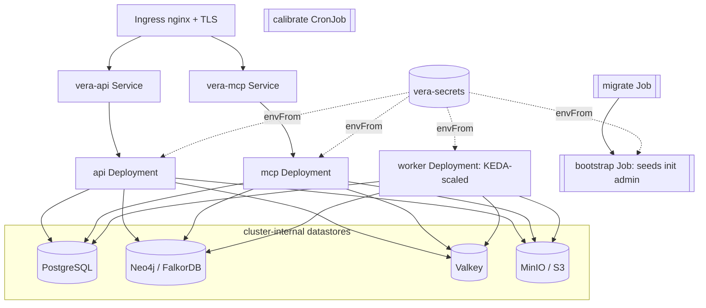

# Deployment

VERA is one container image that runs three processes, differing only by command: the API,
the MCP server, and the ingestion worker. PostgreSQL and S3 are authoritative; Neo4j is a
rebuildable projection; Valkey is cache and rate limiter.

## The Image

The release workflow publishes the image to GHCR as a public package, so most deployments
just pull it:

```bash
docker pull ghcr.io/kkloudtarus/vera:latest   # or a version tag, e.g. :0.2.0
docker build -t vera:local .                  # or build locally
```

Multi-stage, non-root, runtime dependencies only. The base is pinned to
`python:3.11-slim-bookworm`; the builder patches pip/setuptools/wheel and the runtime applies
OS security updates, so no known-vulnerable package ships (verified by `pip-audit`).

Commands:

- API (default): `uvicorn vera.entrypoints.api.main:app --host 0.0.0.0 --port 8000`
- Worker: `python -m vera.entrypoints.worker.main`
- MCP: `python -m vera.entrypoints.mcp.main`

## Docker Compose (single host)

```bash
docker compose --profile app up --build
```

This runs migrate, then the API (`:8000`), worker, and MCP (`:8080`), alongside the infra
(postgres, neo4j, valkey, minio). The default `docker compose up` (no profile) starts only
the infrastructure, which is what local development uses.

To use FalkorDB instead of Neo4j in Compose, set `VERA_MEMORY__GRAPH_BACKEND=falkordb` and
run `docker compose --profile app --profile falkordb up --build`. Host-run processes use
`VERA_FALKOR__HOST=localhost` and `VERA_FALKOR__PORT=6380`; containers use the service name
`falkordb` and its internal port `6379`.

## Kubernetes

Manifests are in `deploy/k8s/`:

| File | Contents |
|------|----------|
| `base.yaml` | namespace `vera`, `vera-config` ConfigMap, `vera-secrets` Secret, and the `vera-migrate` Job (`alembic upgrade head`) |
| `api.yaml` | API Deployment + Service, CPU HPA, liveness/readiness probes |
| `mcp.yaml` | MCP Deployment + Service |
| `worker.yaml` | worker Deployment, KEDA `ScaledObject` on ingestion queue depth (CPU HPA fallback) |
| `calibrate-cronjob.yaml` | nightly rerank calibration (`calibrate --apply`) |

Apply:

```bash
# 1. Put real values in vera-config (non-secret) and vera-secrets (DSN, OpenAI key, JWT
#    secret, Neo4j password) in base.yaml, or manage them with your secrets tooling.
kubectl apply -f deploy/k8s/base.yaml        # namespace, config, secret, migrate Job
kubectl -n vera wait --for=condition=complete job/vera-migrate
kubectl apply -f deploy/k8s/api.yaml -f deploy/k8s/mcp.yaml -f deploy/k8s/worker.yaml
kubectl apply -f deploy/k8s/calibrate-cronjob.yaml
```

Config and secrets are injected via `envFrom` (the ConfigMap and Secret). The worker scales
on pending queue depth with KEDA; delete the `ScaledObject` and add a CPU HPA if KEDA is not
installed. Per-group serialization is enforced in-process, so worker replicas are safe.

The `deploy/k8s/` manifests are the app tier only and assume PostgreSQL, the graph, Valkey,
and the object store are provided externally (managed services or your own).

## Helm (full Stack in One namespace)

For a single-cluster install of the whole stack, including the datastores, use the chart in
`deploy/helm/vera` (see its README for the full walkthrough). It installs the API, MCP, and
worker plus PostgreSQL, a graph backend (`neo4j` by default, `falkordb` with one flag),
Valkey, and MinIO, with a post-install migrate hook, a MinIO bucket bootstrap, and
health-gated pods. It pulls the published image `ghcr.io/kkloudtarus/vera`, so no local build
is needed.

```bash
helm install vera deploy/helm/vera -n vera --create-namespace --set graph.backend=falkordb
```

The defaults boot with no external credentials (a deterministic embedder and an unauthenticated
local MCP principal). For real use, set an embedder key, turn on auth, close self-service
signup, and seed an init admin:

```bash
helm upgrade vera deploy/helm/vera -n vera \
  --set memory.embedder=voyage --set voyage.apiKey=pa-... \
  --set rerank.crossEncoderEnabled=true --set rerank.crossEncoderProvider=voyage \
  --set environment=prod --set api.authRequired=true --set mcp.jwtSecret=<secret> \
  --set api.registrationOpen=false \
  --set bootstrap.enabled=true --set bootstrap.adminApiKey=vera_<prefix>.<secret>
```

With `api.registrationOpen=false`, `POST /identity/register` returns `403`. The post-install
`bootstrap` Job (`python -m vera.entrypoints.bootstrap_admin`) then seeds one init admin from
`VERA_BOOTSTRAP__*`, idempotently, so a closed deployment still has a first principal; that
admin provisions everyone else through `POST /identity/users`. For GitOps, keep the admin key
out of git: leave `secrets.create=false` and put `VERA_BOOTSTRAP__ADMIN_API_KEY` in the
externally created `vera-secrets` Secret instead of passing it on the command line.

The command above enables the API-key-to-JWT fallback. For browser OAuth, pair MCP with an
external OIDC authorization server that supports authorization code + PKCE and either dynamic
client registration or pre-registered coding-tool clients:

```bash
helm upgrade vera deploy/helm/vera -n vera \
  --set mcp.authAudience=https://mcp-vera.example.net \
  --set mcp.oauthIssuer=https://login.example.net \
  --set mcp.oauthJwksUrl=https://login.example.net/.well-known/jwks.json
```

The IdP must issue JWT access tokens for that audience and the `memory:read`,
`memory:propose`, `memory:feedback`, and `memory:snapshot` scopes. Keep `mcp.jwtSecret`
during rollout; remove it only after OAuth discovery, browser login, refresh, and an MCP tool
call pass end to end. To link pre-provisioned users by email, its access token must also carry
the trusted email and `email_verified: true`; otherwise a personal-only principal is created.
With both configured, OAuth is advertised while fallback JWTs remain valid.



Two services are meant to be exposed through an ingress: `vera-api` (:8000) and `vera-mcp`
(:8080). The chart can render the ingress and cert-manager TLS directly (`ingress.enabled`,
`ingress.apiHost`, `ingress.mcpHost`). The MCP public host must match `mcp.authAudience` and
the `mcp.allowedHosts` list. The datastores stay cluster-internal.

## Configuration

Every setting is an environment variable `VERA_<SECTION>__<FIELD>` (see
`src/vera/config/settings.py`). The ones that matter most in production:

| Variable | Purpose |
|----------|---------|
| `VERA_DB__DSN` | PostgreSQL DSN (source of truth) |
| `VERA_MEMORY__PROVIDER` | `graphiti` to enable the graph |
| `VERA_MEMORY__GRAPH_BACKEND` | graph backend: `neo4j` (default) or `falkordb` (driver shipped in the image since 0.2.0) |
| `VERA_NEO4J__URI` / `USER` / `PASSWORD` | Neo4j graph backend |
| `VERA_FALKOR__HOST` / `PORT` / `PASSWORD` | FalkorDB graph backend (when selected) |
| `VERA_MEMORY__OPENAI_API_KEY`, `VERA_MEMORY__EMBEDDER` | LLM extraction and embeddings |
| `VERA_VOYAGE__API_KEY`, `VERA_VOYAGE__EMBEDDING_MODEL`, `VERA_VOYAGE__EMBEDDING_DIM`, `VERA_VOYAGE__RERANK_MODEL` | Voyage AI embeddings/reranking (optional); dimension changes require group reprocessing |
| `VERA_RERANK__CROSS_ENCODER_ENABLED`, `VERA_RERANK__CROSS_ENCODER_PROVIDER` | stage-3 reranker (`llm` or `voyage`) |
| `VERA_OBJECTSTORE__*` | S3-compatible object store |
| `VERA_RESILIENCE__VALKEY_URL` | shared cache and rate limiter |
| `VERA_MCP__JWT_SECRET`, `VERA_MCP__AUTH_ISSUER`, `VERA_MCP__AUTH_AUDIENCE`, `VERA_MCP__TOKEN_TTL_SECONDS` | Built-in MCP JWT fallback verification and regular-user token issuance |
| `VERA_MCP__OAUTH_ISSUER`, `VERA_MCP__OAUTH_JWKS_URL`, `VERA_MCP__OAUTH_ALGORITHMS` | External OAuth discovery and OIDC access-token verification; use `OAUTH_SIGNING_KEY` only for static-key testing |
| `VERA_API__AUTH_REQUIRED`, `VERA_API__REGISTRATION_OPEN` | require a principal on the API; open or close self-service signup |
| `VERA_BOOTSTRAP__ENABLED`, `VERA_BOOTSTRAP__ADMIN_API_KEY`, `VERA_BOOTSTRAP__ADMIN_EMAIL` | seed the init admin on a closed deployment (the key is a secret) |
| `VERA_CONNECTORS__SPECS` | scheduled connectors (JSON) |

Keep secrets out of the ConfigMap and out of `VERA_CONNECTORS__SPECS`; connectors read their
tokens from environment variables named by `token_env`.

## Operational Commands

Run these as one-off Jobs (same image) or locally against the same config:

```bash
python -m vera.entrypoints.bootstrap_admin       # idempotently seed the init admin (VERA_BOOTSTRAP__*)
python -m vera.entrypoints.create_source ...     # create a knowledge source
python -m vera.entrypoints.reprocess <group>     # rebuild a group's graph from Postgres, then verify
python -m vera.entrypoints.backfill_embeddings <group>       # embed canonical entity names
python -m vera.entrypoints.backfill_chunk_embeddings <group> # embed passage/code chunks (dense retrieval)
python -m vera.entrypoints.backfill_fact_embeddings <group>  # embed facts (dense retrieval)
python -m vera.entrypoints.calibrate --apply     # calibrate rerank weights from feedback
python -m vera.entrypoints.retrieval_eval golden.json   # score retrieval quality (CI gate)
python -m vera.entrypoints.dedup_eval pairs.json # measure the dedup threshold and judge
```

## Disaster Recovery

PostgreSQL and S3 are backed up; Neo4j is rebuilt from them. See
[../docs/dr-runbook.md](dr-runbook.md) for the full procedure, including the automated
post-rebuild verification and the embedding-model change process.

## Health and Observability

- Liveness `GET /health/live`, readiness `GET /health/ready` (checks db, graph, object
  store). The API exposes `/metrics`; the worker uses `:9100/metrics`; and MCP uses a
  scrape-only `:9101/metrics` listener that is not part of its public Service. All are enabled
  by `VERA_OBSERVABILITY__METRICS_ENABLED=true`, and the Kubernetes manifests advertise each
  endpoint with Prometheus scrape annotations.
- Run one MCP ASGI worker per process when metrics are enabled. Scale MCP with pod/container
  replicas; multiple workers in one process group cannot share the process-local `:9101` listener.
- Set `VERA_OBSERVABILITY__OTLP_ENDPOINT` to export OpenTelemetry traces from API, worker,
  and MCP processes.
