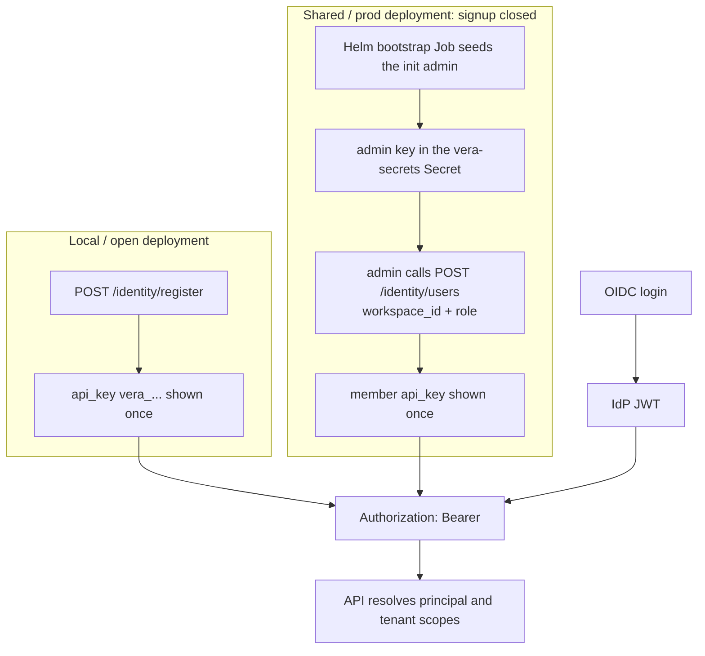

# Getting Started

Run the whole stack locally and confirm it works. About 10 minutes.

## 1. Prerequisites

- Docker and Docker Compose.
- The conda env `vera` (Python 3.11+): `conda activate vera`.

## 2. Install

```bash
git clone https://github.com/KKloudTarus/vera.git
cd vera
conda activate vera
cp .env.example .env
make install          # editable install with all extras, plus pre-commit
```

If upgrading a checkout that previously stored Postgres in `.data/postgres`, move it once
into an empty Docker named volume before starting the new stack. Keep `.data/postgres` as a
backup until the migrated database is verified:

```bash
docker compose stop postgres
docker compose rm -f postgres
docker compose create postgres
docker run --rm -v "$PWD/.data/postgres:/source:ro" -v vera_postgres-data:/target \
  alpine:3.22 sh -c 'cp -a /source/. /target/'
docker compose start postgres
```

## 3. Start the Infrastructure

```bash
make up               # postgres, neo4j, valkey, minio (Docker)
make migrate          # apply database migrations
```

`make up` starts four services. Defaults (see `docker-compose.yml` and `.env`):

| Service | Purpose                    | Local port |
|---------|----------------------------|------------|
| postgres| source of truth + queue    | 5432       |
| neo4j   | knowledge graph projection | 7687 / 7474|
| valkey  | cache + rate limiter       | 6379       |
| minio   | S3-compatible object store | 9000 / 9001|

## 4. Configure

Edit `.env`. The minimum to make memory work end to end:

```bash
# Turn the graph on and point at Neo4j.
VERA_MEMORY__PROVIDER=graphiti
VERA_NEO4J__URI=bolt://localhost:7687
VERA_NEO4J__USER=neo4j
VERA_NEO4J__PASSWORD=vera-local-pass

# To extract facts from free text (Markdown, Confluence, Git), set a key and the OpenAI
# embedder. Without a key, only structured (CMDB triple) sources produce graph facts.
VERA_MEMORY__EMBEDDER=openai
VERA_MEMORY__OPENAI_API_KEY=sk-...
```

For an OpenAI-compatible server running on the Docker host, also set
`VERA_MEMORY__OPENAI_BASE_URL=http://host.docker.internal:<port>/v1` and select its model
IDs with `VERA_MEMORY__LLM_MODEL` and `VERA_MEMORY__SMALL_LLM_MODEL`. For a no-auth
endpoint, set `VERA_MEMORY__OPENAI_API_KEY=local`; key presence enables LLM features.

Every setting is namespaced `VERA_<SECTION>__<FIELD>`; see `src/vera/config/settings.py`
for the full list. Secrets load from the environment as `SecretStr`; never commit `.env`.

## 5. Run the Processes

In separate terminals:

```bash
make run-api          # http://localhost:8000  (OpenAPI docs at /docs)
make run-worker       # ingestion worker (syncs connectors, drains the queue)
```

The MCP server is optional at this point:

```bash
python -m vera.entrypoints.mcp.main   # http://localhost:8080/mcp
```

## 6. Smoke Test

```bash
curl -s localhost:8000/health/live     # {"status":"ok"}
curl -s localhost:8000/health/ready    # checks db, graph, object store
```

### Get a Credential

How you get an API key depends on whether self-service signup is open. It is on by default
locally (`VERA_API__REGISTRATION_OPEN=true`) and a shared or production deployment closes it,
so an admin provisions accounts instead. Every request then carries the key (or an OIDC JWT)
as a bearer token, and VERA resolves the caller's tenant scopes server-side.



On an open deployment, register and use the key:

```bash
curl -s -X POST localhost:8000/identity/register \
  -H 'content-type: application/json' \
  -d '{"display_name":"Alice","email":"alice@example.com"}'
# the response contains an api_key, shown once

KEY=vera_...   # from the register response
curl -s localhost:8000/identity/me -H "authorization: Bearer $KEY"
```

On a closed deployment, `/identity/register` returns `403`. An admin provisions you in a
workspace and hands you the key:

```bash
# run by an admin holding an admin key
curl -s -X POST https://api.example/identity/users \
  -H "authorization: Bearer $ADMIN_KEY" -H 'content-type: application/json' \
  -d '{"workspace_id":"<uuid>","display_name":"Alice","email":"alice@example.com","role":"member"}'
```

The init admin itself is seeded once by the Helm bootstrap Job; see [deployment](deployment.md).
You now have a running VERA with an account but no memory yet. Next:
[load knowledge](loading-knowledge.md).

## Run the Tests (optional)

```bash
make check            # ruff, pyright, import-linter, unit tests (the CI gate)
make test-int         # integration tests (uses the compose stack)
```
