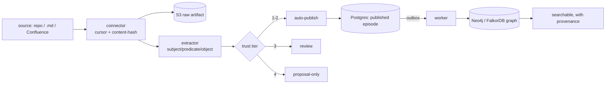

# Loading Knowledge

This is the end-to-end flow that turns a repository, a folder of Markdown, or a Confluence
space into verified, searchable memory. It has five steps, then per-source recipes.



## Do I Need an LLM?

It depends on the source shape:

- **Free text** (Markdown, Confluence pages, Git commit messages) is turned into facts by an
  LLM extractor. Set `VERA_MEMORY__OPENAI_API_KEY` and `VERA_MEMORY__EMBEDDER=openai`.
  Without a key, these connectors still fetch and store the raw artifacts, but produce no
  graph facts.
- **Structured** sources (a CMDB that already emits `(subject, predicate, object)` triples)
  need no LLM and work fully offline.

To build the graph at all you also need `VERA_MEMORY__PROVIDER=graphiti` and a reachable
Neo4j (see [getting-started](getting-started.md)).

## Choosing the Embedding and Reranking Provider

Embeddings and reranking are reached through ports, so the provider is a configuration
choice, not a rewrite. Extraction (turning text into claims) always uses an LLM; only the
embedding and reranker backends are swappable here.

- **Embeddings** (`VERA_MEMORY__EMBEDDER`): `deterministic` (offline, tests), `openai`
  (`text-embedding-3-small`, default), or `voyage` (Voyage AI). For Voyage, set
  `VERA_VOYAGE__API_KEY`, pick `VERA_VOYAGE__EMBEDDING_MODEL` (e.g. `voyage-3.5`,
  `voyage-4-lite`, `voyage-code-4`), and set `VERA_VOYAGE__EMBEDDING_DIM` to match
  (256/512/1024/2048). A group is pinned to one embedding dimension; changing it means
  reprocessing that group (`python -m vera.entrypoints.reprocess <group>`).
- **Dense retrieval**: enable with `VERA_MEMORY__VECTOR_SEARCH_ENABLED=true`. Existing groups
  need both `python -m vera.entrypoints.backfill_chunk_embeddings <group>` and
  `python -m vera.entrypoints.backfill_fact_embeddings <group>` before dense retrieval is
  complete.
- **Reranking** (stage 3): off by default. Enable with
  `VERA_RERANK__CROSS_ENCODER_ENABLED=true` and choose
  `VERA_RERANK__CROSS_ENCODER_PROVIDER` = `llm` (an LLM scores relevance) or `voyage`
  (a purpose-built reranker, `VERA_VOYAGE__RERANK_MODEL` e.g. `rerank-2.5`), which is
  cheaper and faster than the LLM path. `VERA_RERANK__CROSS_ENCODER_MIN_SCORE` controls the
  fail-closed relevance threshold for semantic fact candidates.

You can mix providers, for example OpenAI for extraction and Voyage for embeddings and
reranking. To compare quality before switching, use `python -m vera.entrypoints.dedup_eval`
and `python -m vera.entrypoints.retrieval_eval` on a labeled set.

## Loading non-English Sources

Non-English content (for example Vietnamese) is a first-class case, so a mixed-language corpus
loads with no extra setup for lexical search. Full-text search uses the PostgreSQL `simple`
configuration, which applies no English stemming or stopword filtering and preserves diacritics,
and alias normalization keeps accents, so a term matches by its exact form in any language.
Cross-lingual *semantic* matching (query in one language, find a fact written in another) needs
a multilingual embedder: use `openai` (`text-embedding-3-small`) or `voyage`
(`voyage-3.5` / `voyage-4-lite`), not the `deterministic` embedder. Extraction quality on
non-English text follows the extraction LLM you configure.

## Step 1: Create the Tenancy

Knowledge lives in a scope. Create an organization, a workspace, and a project; the
project's `group_id` (`p:...`) is where facts will live. Use the API key from registration.

```bash
KEY=vera_...   # from POST /identity/register

ORG=$(curl -s -X POST localhost:8000/identity/orgs \
  -H "authorization: Bearer $KEY" -H 'content-type: application/json' \
  -d '{"name":"Acme","slug":"acme"}')
ORG_ID=$(echo "$ORG" | python -c "import sys,json;print(json.load(sys.stdin)['id'])")

WS=$(curl -s -X POST localhost:8000/identity/workspaces \
  -H "authorization: Bearer $KEY" -H 'content-type: application/json' \
  -d "{\"org_id\":\"$ORG_ID\",\"name\":\"Platform\",\"slug\":\"platform\"}")
WS_ID=$(echo "$WS" | python -c "import sys,json;print(json.load(sys.stdin)['id'])")

PROJ=$(curl -s -X POST localhost:8000/identity/projects \
  -H "authorization: Bearer $KEY" -H 'content-type: application/json' \
  -d "{\"workspace_id\":\"$WS_ID\",\"name\":\"API\",\"slug\":\"api\"}")
GROUP=$(echo "$PROJ" | python -c "import sys,json;print(json.load(sys.stdin)['group_id'])")

echo "workspace=$WS_ID group=$GROUP"
```

## Step 2: Create a Knowledge Source

A connector ingests into a **source**: a row that carries the source's kind and its
**trust tier**. Creating a source is an operator action, so it is a CLI, not an API call:

```bash
SOURCE_ID=$(python -m vera.entrypoints.create_source \
  --group "$GROUP" --workspace "$WS_ID" \
  --kind filesystem --name "Team docs" --tier 1)
echo "source=$SOURCE_ID"
```

`--kind` is one of `filesystem`, `git`, `confluence`, `jira`, `slack`, `pdf`, `cmdb`.
`--tier` sets how much VERA trusts it:

| Tier | Meaning       | What happens to its claims |
|------|---------------|----------------------------|
| 1    | Authoritative | auto-published             |
| 2    | Curated       | auto-published             |
| 3    | Informational | held for human review      |
| 4    | Unverified    | proposal only              |

Use tier 1 or 2 for a source you trust (your own docs, your CMDB). Use tier 3 for something
that should be reviewed before it becomes shared truth.

## Step 3: Configure the Connector

The worker syncs connectors on a schedule from `VERA_CONNECTORS__SPECS`, a JSON array. Each
entry names its `kind`, the `source_id` and `group_id` from above, an `interval_s`, and
kind-specific fields. Put it in `.env` (single line):

```bash
VERA_CONNECTORS__SPECS=[{"kind":"filesystem","source_id":"<SOURCE_ID>","group_id":"p:<...>","interval_s":600,"root":"/absolute/path/to/docs"}]
```

Secrets never go in this JSON. HTTP connectors read their token from an environment variable
named by `token_env` (see the Confluence recipe below).

## Step 4: Run the Worker

```bash
make run-worker
```

The worker runs due connectors (every few cycles), fetches changed records, extracts claims,
applies the trust tier, publishes, and projects to the graph. Watch the logs for
`connector.registered` at startup and `ingest.done` per fact. A malformed spec is logged as
`connector.spec_skipped` and does not stop the worker.

## Step 5: Verify

Search the project scope (see [usage](usage.md) for the full API):

```bash
curl -s -X POST localhost:8000/memory/search \
  -H "authorization: Bearer $KEY" -H 'content-type: application/json' \
  -d '{"text":"what does the payment service depend on","limit":5}'
```

Each hit carries `source_id`, `verification`, `authority`, and its signals.

---

## Recipe: A Folder of Markdown (`.md`)

The filesystem connector reads `*.md`, `*.mdx`, `*.txt`, and `*.rst` recursively, and
re-syncs only files changed since the last run (by modification time).

```bash
SOURCE_ID=$(python -m vera.entrypoints.create_source \
  --group "$GROUP" --workspace "$WS_ID" --kind filesystem --name "Docs" --tier 1)
```

```bash
VERA_CONNECTORS__SPECS=[{"kind":"filesystem","source_id":"<SOURCE_ID>","group_id":"p:<...>","interval_s":600,"root":"/data/knowledge"}]
```

Point `root` at any directory. Mount it into the worker container in production.

## Recipe: Understand a Repository

Two complementary ways to feed a code repository:

1. **Its documentation** (recommended for "understand the concept"). Point the filesystem
   connector at the repo's `docs/` (or the repo root) so the design docs, runbooks, and
   READMEs become facts:

   ```bash
   SOURCE_ID=$(python -m vera.entrypoints.create_source \
     --group "$GROUP" --workspace "$WS_ID" --kind filesystem --name "myrepo docs" --tier 2)
   # spec: {"kind":"filesystem","source_id":"...","group_id":"...","interval_s":900,"root":"/repos/myrepo"}
   ```

2. **Its history.** The git connector reads commit messages as records, incrementally from
   the last seen commit, so the "why" behind changes becomes memory:

   ```bash
   SOURCE_ID=$(python -m vera.entrypoints.create_source \
     --group "$GROUP" --workspace "$WS_ID" --kind git --name "myrepo history" --tier 2)
   # spec: {"kind":"git","source_id":"...","group_id":"...","interval_s":3600,"repo_path":"/repos/myrepo"}
   ```

Both need the LLM extractor (a key) to turn prose into facts. Ask about the repo afterward
with a normal search, or trace how components connect with multi-hop
[explore](usage.md#multi-hop-explore).

## Recipe: Confluence

The Confluence connector reads pages in a space (`space_key`) via the REST API, incrementally
by last-modified time. It authenticates with a bearer token read from the environment
variable you name in `token_env` (a Confluence Data Center / Server personal access token; do
not put the token in the spec).

```bash
export CONFLUENCE_TOKEN=<your-personal-access-token>

SOURCE_ID=$(python -m vera.entrypoints.create_source \
  --group "$GROUP" --workspace "$WS_ID" --kind confluence --name "ENG space" --tier 2)
```

```bash
VERA_CONNECTORS__SPECS=[{"kind":"confluence","source_id":"<SOURCE_ID>","group_id":"p:<...>","interval_s":1800,"base_url":"https://wiki.example.com","space_key":"ENG","token_env":"CONFLUENCE_TOKEN"}]
```

`base_url` is your Confluence base (the connector calls `<base_url>/rest/api/content/search`).
Jira and Slack connectors follow the same shape (`project_key` for Jira, `channel_id` for
Slack), each with its own `token_env`.

## Multiple Sources

`VERA_CONNECTORS__SPECS` is a JSON array, so list several connectors at once. Each keeps its
own sync cursor, so re-running a sync is a no-op for unchanged records (content-hash
idempotency) and only new or changed records are processed.

## Correcting or Forgetting a Fact

A published source can be withdrawn (removed from the graph, hidden from search, skipped by a
rebuild), and erased (its raw bytes deleted) for data-subject requests. See
[usage](usage.md#retraction-and-erasure).
